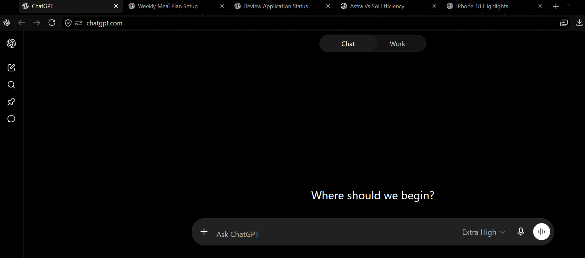

<p align="center">
  
</p>

<h1 align="center">Web App Tabs for Firefox</h1>

<p align="center"><strong>One web app. All your tabs.</strong></p>

<p align="center">
  <a href="https://github.com/rajpiskala/web-app-tabs-for-firefox/actions/workflows/ci.yml"></a>
  <a href="https://support.mozilla.org/kb/web-apps-firefox-windows"></a>
  
  <a href="LICENSE"></a>
  <a href="https://github.com/sponsors/rajpiskala"></a>
</p>

<p align="center">
  <a href="#installation">Installation</a> ·
  <a href="#usage">Usage</a> ·
  <a href="#how-it-works">How it works</a> ·
  <a href="#development">Development</a> ·
  <a href="PRIVACY.md">Privacy</a>
</p>

<p align="center">
  
</p>

<p align="center"><em>Five conversations, one standalone ChatGPT web app window—using native Firefox tabs.</em></p>

Firefox web apps open in focused, app-like windows—but Firefox normally hides
their tab strip and sends new tabs to the main browser window. Web App Tabs
opens another page in the focused web app window, revealing Firefox's native
tab strip and letting you keep the whole workflow together.

It does not launch another Firefox runtime, patch Firefox, or inject scripts
into websites.

## Features

- Opens multiple tabs in any HTTP or HTTPS Firefox web app.
- Works from the toolbar popup, page context menu, or **Alt+Shift+G**.
- Lets you record, clear, or reset the keyboard shortcut from the popup.
- Includes light and dark popup themes.
- Opens every ChatGPT tab as a fresh chat.
- Reopens the current URL for other sites and ordinary Firefox tabs.
- Uses no content scripts, site-wide access, analytics, or telemetry.

## Installation

### Mozilla Add-ons

The first signed Mozilla Add-ons release is being prepared. The official
installation link will appear here after Mozilla approves it.

### Try the current version

Temporary installation is useful for testing the extension before its signed
release:

1. [Download the source](https://github.com/rajpiskala/web-app-tabs-for-firefox/archive/refs/heads/main.zip)
   and extract it.
2. Open `about:debugging#/runtime/this-firefox` in Firefox.
3. Select **Load Temporary Add-on**.
4. Choose `src/manifest.json` from the extracted folder.

Firefox removes temporary add-ons when the browser restarts.

## Usage

1. Open a site in Firefox and choose **Add tab to taskbar** from the address
   bar.
2. Launch the site from its standalone Windows taskbar or Start menu icon.
3. Press **Alt+Shift+G**, open the extension popup, or use **Open another tab in
   this window** from the page context menu.
4. Firefox reveals its native tab strip and opens the new tab beside the
   current one.

Click **What counts as a web app?** in the popup if you are unsure whether you
opened the standalone app window.

## How it works

The extension uses Firefox's public WebExtensions API to create a tab with the
focused window's exact `windowId`. Firefox then reveals the tab strip that is
already present in the web app window.

ChatGPT has a small start-page override so another tab begins at
`https://chatgpt.com/`. For other sites, Firefox does not expose the installed
web app's registered start URL, so the extension opens the current page URL
again. This is a fresh page load, not a copy of the tab's history, scroll
position, or unsaved form state.

The same action works in an ordinary Firefox window as a convenient
reopen-this-page shortcut. Firefox does not expose a reliable web app window
flag to extensions.

## Compatibility and limitations

- Requires Firefox 143 or newer on Windows. Firefox installed through the
  Microsoft Store requires Firefox 150 or newer for native web apps.
- Firefox web apps are currently unavailable on macOS and Linux.
- Firefox's built-in **Ctrl+T** still targets the main browser window; the
  extension cannot replace browser-owned shortcuts.
- This relies on current Firefox behavior and may need adjustment if Firefox's
  web app implementation changes.

## Permissions and privacy

| Permission | Why it is needed |
| --- | --- |
| `activeTab` | Reads the current page URL only after you invoke the extension. |
| `menus` | Adds the page context-menu command. |

The extension stores only the popup's light/dark preference locally. It makes
no extension-owned network requests and requests no browsing-history, cookie,
or broad site-access permissions. See the full [privacy policy](PRIVACY.md).

## Development

Requires [Node.js](https://nodejs.org/) 20 or newer.

```bash
git clone https://github.com/rajpiskala/web-app-tabs-for-firefox.git
cd web-app-tabs-for-firefox
npm ci
npm run check
```

Create and verify the release package with:

```bash
npm run release
```

The unpacked extension is written to `dist/firefox/`; the AMO-ready ZIP is
written to `dist/packages/`. Runtime JavaScript is shipped directly from
`src/` without bundling or minification.

## Contributing

Bug reports and focused pull requests are welcome. Please open an issue before
starting a substantial behavior or interface change, and run `npm run check`
before submitting a pull request.

## Support

If this project saved you some time, fixed something annoying, or made your workflow a little better, you can [sponsor my open-source work](https://github.com/sponsors/rajpiskala). Everything here stays free and open source. 💗

## License

Licensed under the [Mozilla Public License 2.0](LICENSE).

Web App Tabs for Firefox is an independent project and is not produced,
sponsored, or endorsed by Mozilla. Firefox is a trademark of the Mozilla
Foundation in the U.S. and other countries.
